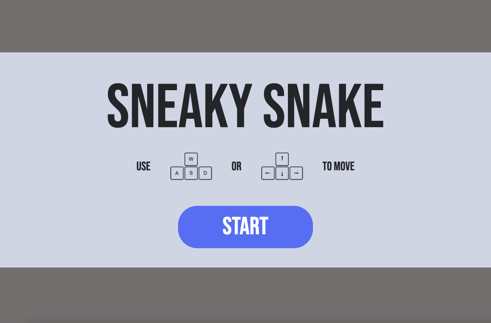
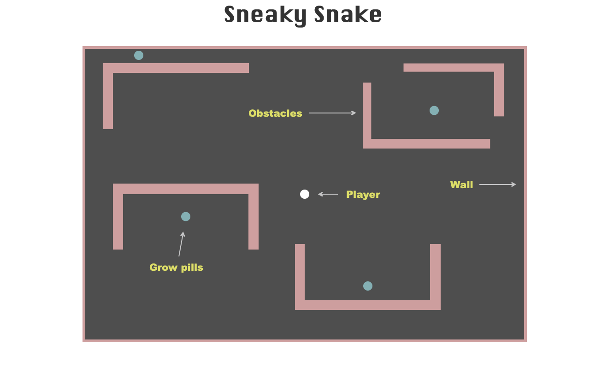

# Sneaky Snake
## About
As my Unit-1 project of General Assembly's SEI course I decided to make the classic snake game using canvas. 

# HOW TO PLAY
Use W,A,S,D or Up, Down, Left, Right arrow keys to move the snake
- Start off as a one cell snake, avoid walls and pick up grow pellets.
- As you pick up grow pellets the snake will grow and another grow pellet will randomly spawn.
- Try and collect as many grow pellets as possible while avoiding the walls and yourself.
- If the snake crashes againts the walls or itself the game is over.

## Start Up Screen:

# FUTURE CONSIDERATIONS
- Increase velocity the longer you're alive
- Increase velocity the longer the snake is
- Spawn random obstacles on the canvas

# Technologies
- HTML
- CSS
- Javascript

## Initial Wireframes:

